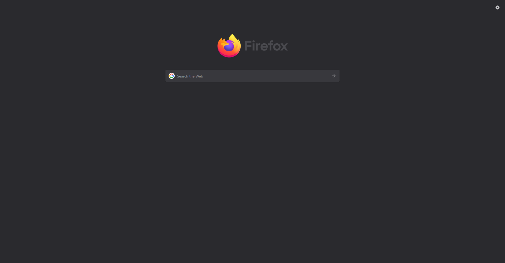
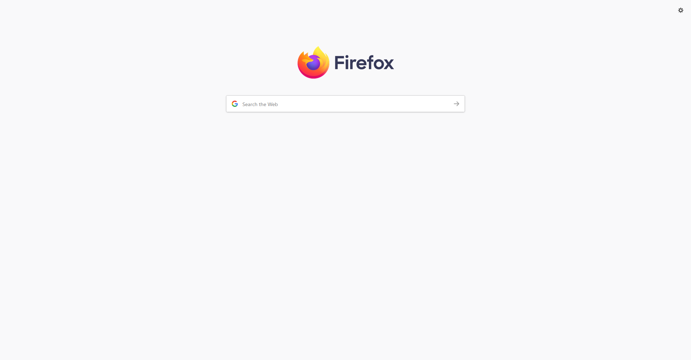

# firefox-dark-new-tab
CSS for a (themed) dark new tab page.

# Usage

Copy a `userContent.css` into `~/.mozilla/firefox/{profile}/chrome/`. You may need to make the `chrome` folder.

# Themes

`dark`

`light`

